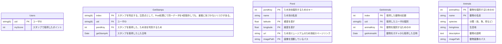

```mermaid
---
Title: "ため池GO! のデータベース設計"
---
erDiagram

    Users {
        string(6) uid PK "ユーザID"
        int myScore "スタンプで取得したポイント"
    }

    GetStamps {
        string(6) index PK "スタンプを特定する。注意点として、Post処理にて同一データをN回保存しても、重複に気づかないリスクがある。"
        string(6) uid FK "ユーザID"
        int pondKey FK "スタンプを取得した、ため池を判別するため"
        Date getStampAt "スタンプを取得したした日時"
    }

    %% ⚠️Pond Classはデータベースに保存しない
    %% あくまでコードロジックに反映させるためのモデル
    Pond {
        int pondKey PK "ため池を識別するためのキー"
        string name "ため池の名前"
        float latitude PK "緯度を表す"
        float longitude PK "経度を表す"
        string url PK "ため池ミュージアムのため池紹介ページリンク"
        string imagePath PK "画像を設置しているパス"
    }

    GetAnimals {
        int index PK "取得した動物の記録"
        string(6) uid FK "取得したユーザの識別"
        int animalKey FK "動物を識別するためのID"
        Date getAnimalAt "動物をガチャから取得した日時"
    }

    %% Animals Classも同様にデータベースへ保存しない
    Animals {
        int animalKey PK "動物を識別するためのID"
        string name PK "動物の名前"
        string spiecies "分類（虫、魚、鳥など）"
        string livingArea "生息地"
        text description "動物の説明"
        string imagePath "動物画像のパス"
    }
```
